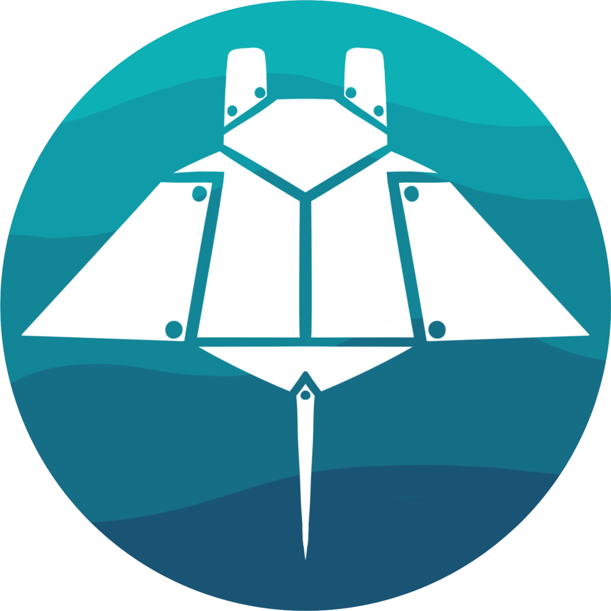

<div align="center">

<br/><br/>

```
                                 M A N T A B O T S  F T C  C O R E
```

<br/>

[ ](https://github.com/FIRST-Tech-Challenge/FtcRobotController)
[ ](https://solverslib.org)
[ ](https://panels.bylazar.com)
[ ](https://pedropathing.com)
[ ](https://mantabots.github.io/core)

<br/>

**A shared, reusable foundation for every FTC season.**
Fork once from FTC Controller. Fork again each year. Focus on robots, not boilerplate.

<br/>

[📖 Full Documentation](https://mantabots.github.io/core) · [🐛 Issues](../../issues) · [🔀 Contribute](../../pulls)

</div>

---

## Overview

This repository is the **Mantabots Core** library — a fork of the official FTC Controller SDK extended with reusable components that persist across competition seasons.

```
FtcRobotController  ──fork──▶  Core  ──fork──▶  Season Project (each year)
     (FIRST)                   (this)
```

Each year's robot project forks Core, inheriting all shared infrastructure while adding season-specific code. **Core never contains season-specific logic.**

---

## Module Structure

| Module | Build target | Purpose |
|---|---|---|
| `FtcRobotController` | Control Hub | Official FIRST SDK — never modified |
| `Core` | Control Hub | Reusable components: gamepad, configuration, alliance management |
| `TeamCode` | Control Hub | Temporary test workspace — not kept long-term |
| `Panels/AllianceNavlet` | Online / local | Dashboard plugin for [Panel by Lazar](https://panels.bylazar.com) |

---

## Build

### 1 — Panels (compile first, on your machine)

The Panels plugins are Kotlin + Svelte projects compiled locally and deployed as `.aar` into `TeamCode/plugin/`.

#### Install Bun

Panels uses [Bun](https://bun.sh) as the JavaScript runtime and package manager.

**macOS**
```bash
brew install oven-sh/bun/bun
```

**Windows**
```powershell
# Option A — winget (recommended)
winget install Oven-sh.Bun

# Option B — PowerShell installer
powershell -c "irm bun.sh/install.ps1 | iex"
```

#### Build

```bash
# Install web dependencies
cd Panels/AllianceNavlet/web && bun install && cd ../../..

# Build AAR and copy to TeamCode/plugin/
./gradlew :Panels:AllianceNavlet:deployToTeamCode
```

### 2 — Core + TeamCode (Control Hub)

Requires **Android Studio Ladybug 2024.2+** and a connected Control Hub (USB or Wi-Fi Direct).

```bash
# Full build (Panels AAR must already be in TeamCode/plugin/)
./gradlew assembleDebug

# Deploy to hub
./gradlew :TeamCode:installDebug
```

Or use the **Run** button in Android Studio targeting the `TeamCode` module.

---

## Key Components

### `Core`

| Class | Package | Description |
|---|---|---|
| `GamepadCombinedEx` | `control` | Extends SolversLib `GamepadEx` to support both physical and virtual Panel gamepads |
| `Alliance` | `configuration` | Singleton managing `BLUE` / `RED` / `NONE` alliance state with LED feedback |
| `Configuration` | `configuration` | Configuration management (WIP) |

### `Panels/AllianceNavlet`

| Class | Description |
|---|---|
| `AlliancePlugin` | Plugin lifecycle, timer-based state sync |
| `PanelsAlliance` | Panels integration layer |
| `AllianceProvider` | Alliance color state provider |

---

## Dependencies

```gradle
// Command framework + gamepad
"org.solverslib:core:0.3.4"
"org.solverslib:pedroPathing:0.3.4"
"org.solverslib:photon:0.3.4"

// Path following
"com.pedropathing:ftc:2.1.0"

// Dashboard]
"com.bylazar:fullpanels:1.0.12"
```

---

## Requirements

- Android Studio Ladybug 2024.2 or later
- Android SDK 30, min SDK 24
- Bun 1.0+ (Panels web build only — replaces Node/npm)
- REV Control Hub running FTC App v11.1+

---

<div align="center">

Made with ❤️ by **Mantabots** · Built on [FTC Controller v11.1](https://github.com/FIRST-Tech-Challenge/FtcRobotController)

</div>
